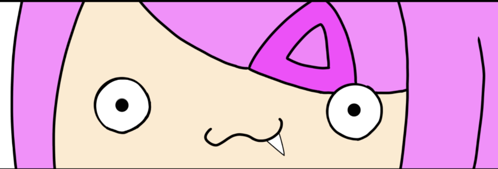
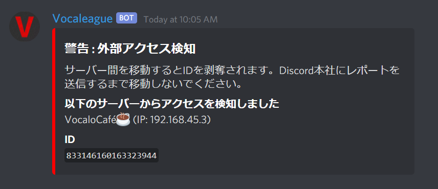

# VocaloCafe内輪ネタ集

このサーバーはもともと"あまなー界隈"というところからできたサーバーです。
そのため、内輪ネタ・古参ネタがたくさんあります。
ここでは、その内輪ネタ・古参ネタを紹介していこうと思います。

??? example "ﾜｶﾁｺ"
    最近ではあまり見かけなくなった古参ネタ「ﾜｶﾁｺ」  
    あまちの第二回目配信にて、wktkをﾜｸﾃｶではなく、ﾜｶﾁｺと呼んでしまったところから始まる。

??? example "おはちこ"
    本当の初期～今まで、おぷちゃでずっと使われている言葉です。  
    ﾜｶﾁｺの派生形

??? example "ギバミィ"
    あんころ餅（ネコ丸）のことを指す。  
    当時(?)、【ミラティブ】という配信サイトにて配信していたことが発覚  
    鯖内のVCで常に発狂と号泣を繰り返していたことから、  
    発狂の多い、引退してしまった某V-TuberとVOMSの【天野ピカミィ】を掛けて、  
    【ギバミィ】と呼ばれるようになった。  
    

??? example "あまなー"
    Amachiのリスナー  
    略して【あまなー】  
    【あまな～】とも言う  
    あまちの配信で普及した。  
    youtubeアカウントにつけてる人が多い

??? example "あまなっとう"
    あまなーと納豆を掛けてできた造語  
    一時期、あまなっとうがあまなー界隈のマスコットキャラクターになった。  
    ３つ目の動画が、古参ネタの全てを物語っている...  
    <video width="100%" height="auto" controls>
    <source src="media/am1.mp4" type="video/mp4">
    </video>
    <video width="100%" height="auto" controls>
    <source src="media/am2.mp4" type="video/mp4">
    </video>
    <video width="100%" height="auto" controls>
    <source src="media/am3.mp4" type="video/mp4">
    </video>

??? example "あまぼっち"
    鯖主のAmachiさんが、自他共に認めるぼっちであることからできたネタです。  
    よく一人でボイチャにいるため、あまぼっちと呼ばれるようになりました。  
    もし、Amachiさんが一人でボイチャにいたら、あまぼっちって呼んであげましょう。  

??? example "はふう"
    はふぅ！とは、りむさんが、以前やふぅ！というのを言い間違えた時にできた言葉です。現在は、リムさん本人を指す場合もあります。  
    鯖内で、はふぅと打つとメンションされたり、消されたりしてしまうので、「はふう」と使ったり「はふ　ぅ」と書かれる事もあります。（誤字じゃないよ）  

!!! example "「しね」"

??? example "🌽 リアクション"
    上のﾜｶﾁｺから派生した  
    「おつちこ・ばいちこ」  
    をコーン（トウモロコシ）と掛けたネタ  
    作ったのは、"メッセージ送信を禁止されていた"コヨミ📅さん

??? example "あくたが女殴る（女殴ってそう）"
    スクドラが面白がって、つけたネタ  
    元々女殴ってる雰囲気だったから殴ってるって言って、その後、あくさんがセンター分けと判明し、センター分けでマジで殴ってんじゃんwwwwwとなったそう。（本人談）  
    ＊実際に殴ってるわけではないので、ご注意ください

??? example "あびゃあ"

??? example "夜桜"

??? example "全裸"

??? example "ゴミーズ（ゴーミーズ＆Gm’s）"

??? example "ゴマーズ"
    きのこのこが、Gm'sを読み間違えたことでできたネタ

??? example "あまちのどっきり企画"
    あまちのやらかしの一つ  
    Pythonをそこそこ理解し、Bot開発をそこそこ理解したことで、調子に乗り、【Amachiの開発仲間(仮)】所属のReply・Zect監修の元、クラッカーによるサーバー乗っ取りどっきりを行った。  
    案の定、どっきりは大成功！  
    しかし、過呼吸を起こす人が出たり、普段怒らない人が激怒するなど、結果は散々となった。  
    結果、Amachiは病み、当時存在していたAmachiが運営していたサーバーを全部消し、すべてが幕を閉じた。  
    

??? example "Amachiの開発仲間(仮)"
    いつ始まったかもつけてる本人は知らない。確か、【名無し。】というプログラマーがつけてたから、ノリでつけてみたから？よく覚えとらん  
    by. Zect  
    [TeamAmaner](http://github.com/TeamAmaner)

??? example "お前もコノ・ナマエにならないか？"
??? example "増殖"
    サブ垢の名前を変更して、VCに同じ名前の人を量産したところから始まった。
    ??? example "（実は...）"
        あまちが「暇だから」と言って、同じVCの人のニックネームを管理者権限使って変更したのが起源

??? example "暇人"
    これは、【Mee6】という会話しただけレベルが上がっていくシステムのランキング上位者の敬称(蔑称)である。  
    起源は、  
    「レベル高い人すごいな...」  
    「あれ、暇なだけだよ。」  
    ⇩レベル一覧  
    [MEE6 - The Discord Bot](https://mee6.xyz/leaderboard/808283612105408533)
    
> 内輪ネタ募集中！
> ・「これ、内輪ネタじゃね？」
> ・「俺はGmじゃねーー！！！」
> ・「この文章追加して！」
> ・「え？あまちはぼっちだよ？」
> 等ありましたら、
> 本部の【# 質問・要望・相談】か
> Zect#3279のDiscord DMまで